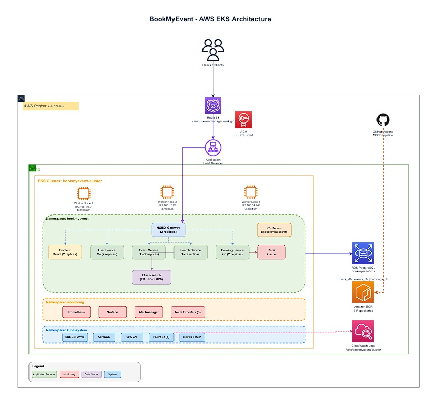

# BookMyEvent - Cloud-Native Event Booking Platform on AWS EKS

**ENPM818R Group 5 Project:** Cloud-Native Application Deployment using AWS EKS, Kubernetes, and Load Balancing


BookMyEvent is a production-ready, cloud-native event booking platform deployed on **AWS Elastic Kubernetes Service (EKS)**. It features:
- 4 backend Go microservices (user, event, search, booking)
- A modern React frontend (Vite)
- An init-container for DB setup
- Automated CI/CD, observability, and security best practices
for managing campus events, workshops, and activities.


## 🎓 Project Overview

**Course:** ENPM818R - Virtualization & Containerization  
**Institution:** University of Maryland  
**Semester:** Fall 2025  
**Team Size:** 7  
**Project Duration:** 5 weeks


**Key Features:**
- **Containerized Microservices**: 4 backend APIs (user, event, search, booking), frontend (React), and supporting infrastructure
- **Infrastructure as Code**: Automated EKS cluster provisioning (eksctl/CloudFormation)
- **Production Deployment**: Multi-AZ EKS cluster, auto-scaling, managed RDS, Redis, Elasticsearch
- **DevOps Automation**: CI/CD with GitHub Actions, Makefile, and scripts
- **Observability**: Prometheus, Grafana, CloudWatch, and alerting
- **Security**: AWS Secrets Manager, RBAC, IRSA, network policies, and encrypted storage


### Highlights
- **High Availability**: Multi-AZ, auto-scaling, and resilient design
- **Zero Overselling**: Distributed concurrency control and atomic operations
- **Real-Time Search**: Elasticsearch-powered event discovery
- **Smart Waitlisting**: Redis-backed queue management
- **Comprehensive Monitoring**: Metrics, logs, and alerting

---

eks-microservices/

## 📂 Repository Structure (2025)

```
eks-microservices-build/
├── .github/                # GitHub Actions CI/CD workflows
│   └── workflows/          # Build, deploy, and monitoring pipelines
│
├── cmd/                    # Service entry points (main.go for each microservice)
│   ├── booking-service/
│   ├── event-service/
│   ├── search-service/
│   └── user-service/
│
├── docs/                   # Project documentation
│   ├── architecture.md
│   ├── BACKUP_RESTORE_RUNBOOK.md
│   ├── MONITORING_RUNBOOK.md
│   ├── build/
│   ├── deployment/
│   └── secrets/
│
├── frontend/               # React (Vite) frontend app
│   ├── src/
│   ├── public/
│   ├── package.json
│   └── vite.config.js
│
├── helm/                   # Helm charts for Kubernetes deployment
│   ├── Chart.yaml
│   ├── values.yaml
│   ├── values-dev.yaml
│   ├── values-prod.yaml
│   └── templates/
│
├── init-container/         # DB initialization Go app
│   ├── main.go
│   └── go.mod
│
├── internal/               # Shared Go packages (auth, config, db, etc.)
│   ├── auth/
│   ├── cache/
│   ├── config/
│   ├── constants/
│   ├── database/
│   ├── logger/
│   ├── middleware/
│   ├── repository/
│   └── utils/
│
├── k8s/                    # Raw Kubernetes manifests
│   ├── 00-namespace.yml
│   ├── 01-configmap.yml
│   ├── 02-secrets-rds.yml
│   ├── infrastructure/
│   ├── jobs/
│   ├── logging/
│   ├── monitoring/
│   ├── networkpolicy/
│   ├── rbac/
│   ├── secrets-management/
│   └── services/
│
├── migrations/             # DB migrations (per service)
│   ├── booking-service/
│   ├── event-service/
│   └── user-service/
│
├── scripts/                # Automation scripts
│   ├── apply-monitoring.sh
│   ├── build-local.sh
│   ├── push-to-ecr.sh
│   ├── test-docker-compose.sh
│   ├── eks/
│   ├── k8s/
│   └── testing/
│
├── services/               # Go HTTP handlers & business logic
│   ├── booking/
│   ├── event/
│   ├── search/
│   └── user/
│
├── sqlc/                   # SQL queries for sqlc codegen
│   ├── booking-service/
│   ├── event-service/
│   └── user-service/
│
├── docker-compose.yml      # Local dev orchestration
├── Makefile                # Build automation
├── go.mod / go.sum         # Go dependencies
├── DEPLOYMENT_GUIDE.md     # Production deployment guide
├── CONTRIBUTING.md         # Contribution guidelines
└── README.md               # Project overview (this file)
```


### Directory Highlights

- **cmd/**: Entrypoints for each Go microservice (user, event, search, booking)
- **services/**: HTTP handlers and business logic for each microservice
- **internal/**: Shared Go code (auth, config, db, cache, middleware, etc.)
- **frontend/**: Vite + React 18 SPA frontend
- **helm/**: Helm charts for Kubernetes deployment
- **k8s/**: Raw Kubernetes manifests (YAML) for infrastructure, services, monitoring, and security
- **migrations/**: Database schema migrations (per service)
- **sqlc/**: SQL queries for type-safe Go code generation
- **scripts/**: Automation scripts for build, deployment, and testing
- **docs/**: Architecture, deployment, monitoring, backup, and secrets documentation

---

## 🏗️ High-Level Architecture

<!-- **Note:** Insert high-level architecture diagram here showing:
- AWS Cloud boundary
- VPC with public/private subnets across multiple AZs
- EKS Control Plane
- Worker Nodes (3+ nodes)
- Application Load Balancer
- Microservices (User, Event, Search, Booking, Frontend)
- Data Layer (RDS PostgreSQL, Redis, Elasticsearch)
- Monitoring Stack (Prometheus, Grafana)
- External Services (ECR, Secrets Manager, CloudWatch)
-->



**Key Components:**

1. **AWS EKS Cluster**
   - Control Plane: Managed by AWS
   - Worker Nodes: 3x t3.medium across multiple Availability Zones
   - Auto-scaling enabled for workload flexibility

2. **Application Load Balancer (ALB)**
   - Entry point for all external traffic
   - HTTPS/TLS termination with ACM certificates
   - Health check integration with Ingress Controller

3. **NGINX Ingress Controller**
   - Routes traffic to appropriate microservices
   - Path-based routing: `/api/user/`, `/api/event/`, etc.
   - Internal API gateway for service mesh

4. **Microservices (ClusterIP)**

   - User Service: Authentication & user management
   - Event Service: Event CRUD and availability management
   - Search Service: Elasticsearch-powered search
   - Booking Service: Reservation and payment processing
   - Frontend: React SPA served by nginx
   - Init-Container: Database initialization

5. **Data Layer**
   - RDS PostgreSQL: Persistent relational data (3 databases)
   - Redis: In-memory caching and reservation queue
   - Elasticsearch: Full-text search index
   - EBS CSI Driver: Persistent volumes for StatefulSets

6. **Monitoring & Observability**
   - CloudWatch Logs: Application and system logs
   - Prometheus: Metrics collection
   - Grafana: Visualization dashboards
   - Alertmanager: Alert routing and notifications


> 📖 **For detailed architecture information**, see [docs/architecture.md](docs/architecture.md)

---


## 🚀 Quickstart

### Prerequisites
- Go 1.21+
- Node.js 18+ and npm
- Docker & Docker Compose
- kubectl, eksctl, AWS CLI, Helm 3.x

### Local Development
```bash
git clone https://github.com/heena5498/eks-microservices.git
cd eks-microservices-build
cp .env.example .env
# Edit .env as needed
docker-compose up -d
make migrate-up-all
```

### Production Deployment
See [DEPLOYMENT_GUIDE.md](DEPLOYMENT_GUIDE.md) for full EKS deployment steps.

---

## 🤝 Contributing
See [CONTRIBUTING.md](CONTRIBUTING.md) for team, setup, and contribution guidelines.

---

## 📚 Documentation
- [Architecture](docs/architecture.md)
- [Deployment Guide](DEPLOYMENT_GUIDE.md)
- [Backup & Restore Runbook](docs/BACKUP_RESTORE_RUNBOOK.md)
- [Monitoring Runbook](docs/MONITORING_RUNBOOK.md)
- [Secrets Management](docs/secrets/README.md)

---

## 📝 License
This project is licensed under the MIT License.
- **Persistent Storage**: EBS CSI driver for stateful workloads
- **Secrets Management**: AWS Secrets Manager with External Secrets Operator

## 👥 For Team Members - Getting Started

**New to the project?** Start here:

### Prerequisites

- **AWS Account**: With permissions for EKS, ECR, IAM, VPC, and EC2
- **Development Tools**: 
  - AWS CLI v2 ([Install Guide](https://docs.aws.amazon.com/cli/latest/userguide/getting-started-install.html))
  - kubectl ([Install Guide](https://kubernetes.io/docs/tasks/tools/))
  - eksctl ([Install Guide](https://eksctl.io/installation/))
  - Docker Desktop
  - Go 1.21+
  - Node.js 18+ (for frontend)

### Quick Start

1. **Clone the repository**:
   ```bash
   git clone https://github.com/heena5498/eks-microservices.git
   cd eks-microservices
   ```

2. **Local Development Setup**:
   ```bash
   make dev-setup-full  # Starts PostgreSQL, Redis, Elasticsearch
   ```

3. **Deploy to AWS EKS** (Production):
   ```bash
   # Push to build branch to trigger GitHub Actions deployment
   git checkout build
   git push origin build
   
   # Or manually trigger deployment via GitHub Actions UI
   # Actions → Deploy BookMyEvent → Run workflow
   ```

> 📖 **For complete deployment instructions**, see [EKS Deployment Guide](docs/deployment/eks-deployment-guide.md) and [Production Deployment Guide](DEPLOYMENT_GUIDE.md)

>  **Security Best Practices**:
> - Never commit AWS credentials or secrets to Git
> - Use AWS Secrets Manager for production secrets
> - Enable MFA on your AWS account
> - Follow least-privilege IAM principles
> - Review [Security & Compliance](docs/deployment/eks-project-md.md#security--compliance)

## AWS EKS Deployment

### Automated GitHub Actions Deployment

Deploy complete production environment to AWS EKS using GitHub Actions CI/CD:

```bash
# Push to build branch to trigger automated deployment
git checkout build
git push origin build
```


**The GitHub Actions pipeline automatically:**
1. Builds all service and frontend Docker images with multi-stage builds (~5-8 min)
2. Scans images for vulnerabilities with Trivy
3. Pushes images to Amazon ECR with semantic versioning
4. Deploys Helm chart to EKS cluster (~3-5 min)
5. Creates RDS databases (users_db, events_db, bookings_db) if they don't exist
6. Runs database migrations via Kubernetes Job
7. Deploys all microservices, frontend, and init-container with ConfigMaps and Secrets
8. Configures AWS ALB with nginx-gateway Ingress
9. Runs integration tests to validate deployment

**Total deployment time:** ~15-20 minutes

**Manual Trigger:**
You can also manually trigger deployment from GitHub:
- Navigate to **Actions** → **Deploy BookMyEvent**
- Click **Run workflow** → Select **build** branch → **Run**

### Access Your EKS Deployment

After deployment completes:

```bash
# Get LoadBalancer URL
kubectl get ingress -n bookmyevent

# Access services
INGRESS_URL=$(kubectl get ingress bookmyevent-ingress -n bookmyevent -o jsonpath='{.status.loadBalancer.ingress[0].hostname}')
echo "API Gateway: http://$INGRESS_URL"
```


**Endpoints:**
- **Frontend**: `https://<INGRESS_URL>/` or your custom domain
- **User API**: `https://<INGRESS_URL>/api/user/`
- **Event API**: `https://<INGRESS_URL>/api/event/`
- **Search API**: `https://<INGRESS_URL>/api/search/`
- **Booking API**: `https://<INGRESS_URL>/api/booking/`
- **Health Check**: `https://<INGRESS_URL>/health`


**Custom Domain:** The application is deployed at `https://campuseventmanager.work.gd` (or your domain) with HTTPS/TLS enabled via AWS Certificate Manager.

> 📖 **For automated testing and validation**, see [CI/CD Testing Guide](docs/build/ci-cd-testing-guide.md)

## 🌐 Client Access & API Gateway


**All external access goes through the nginx gateway, exposed via AWS ALB Ingress.**

### Gateway Access (Production)

- **Ingress URL:** `http://<INGRESS_URL>` or the custom domain (e.g., `https://campuseventmanager.work.gd`)
- **All API and frontend traffic is routed through this gateway.**

#### Example Routes
```
https://campuseventmanager.work.gd/              → Frontend (React SPA)
https://campuseventmanager.work.gd/api/user/     → User Service (auth, profiles)
https://campuseventmanager.work.gd/api/event/    → Event Service (events, venues)
https://campuseventmanager.work.gd/api/search/   → Search Service (event search)
https://campuseventmanager.work.gd/api/booking/  → Booking Service (reservations)
https://campuseventmanager.work.gd/health        → Gateway health check
```

> Replace `campuseventmanager.work.gd` with your actual Ingress hostname if not using the provided domain.

### Frontend Integration Example
```javascript
// All requests go through the gateway (use your Ingress URL or custom domain)
const API_BASE = 'https://campuseventmanager.work.gd';

// Login user
fetch(`${API_BASE}/api/user/auth/login`, {
   method: 'POST',
   headers: {'Content-Type': 'application/json'},
   body: JSON.stringify({email: 'atlanuser1@mail.com', password: '11111111'})
});

// Search events
fetch(`${API_BASE}/api/search/search?q=diwali`);

// Book tickets
fetch(`${API_BASE}/api/booking/reserve`, {
   method: 'POST',
   headers: {
      'Content-Type': 'application/json',
      'Authorization': 'Bearer ' + token
   },
   body: JSON.stringify({event_id: 'EVENT_ID', quantity: 2})
});

## 🔐 Security & Compliance

### Implemented Security Controls

 **Container Security**
- All images scanned with Trivy (no critical vulnerabilities)
- Non-root containers with read-only root filesystems
- Multi-stage Docker builds to minimize attack surface
- Semantic versioning and SHA-based image tags

 **Cluster Security**
- RBAC enabled with least-privilege service accounts
- Pod Security Standards enforced
- Network Policies for service isolation
- IAM Roles for Service Accounts (IRSA)

 **Secrets Management**
- AWS Secrets Manager integration via External Secrets Operator
- No secrets in Git repositories
- Automatic secret rotation support
- Encrypted at rest and in transit

 **Network Security**
- Private subnets for worker nodes
- Security Groups with minimal ingress rules
- TLS termination at ALB (HTTPS enforced)
- Internal service communication via ClusterIP

 **CI/CD Security**
- GitHub Actions with encrypted secrets
- Mandatory code review for all PRs
- Automated security scanning in pipeline
- Branch protection rules on main branch

### Compliance Features

- **Audit Logging**: CloudWatch Logs for all API calls
- **Access Control**: MFA enforced for AWS console
- **Data Encryption**: EBS volumes encrypted at rest
- **Vulnerability Management**: Automated scanning and patching

> 📖 **For secrets management details**, see [Secrets Manager Guide](docs/secrets/secrets-manager-guide.md) and [Secrets Quick Start](docs/secrets/secrets-quickstart.md)

---

## 🧪 Test Data & Demo Credentials

### Auto-Created Test Data


**Test Users:**
- Email: `atlanuser1@mail.com` / Password: `11111111`
- Email: `atlanuser2@mail.com` / Password: `11111111`

**Admin:**
- Email: `atlanadmin@mail.com` / Password: `11111111`

**Events:** 25+ sample events including concerts, workshops, sports events

> **Production Note**: These test credentials are for development/demo only. In production deployments, use secure password policies and remove test accounts.

> 📖 **For integration testing**, see [Testing Guide](scripts/testing/README.md) and [Testing Quick Start](scripts/testing/testing-quickstart.md)

---

## 🚢 Local Development

### Prerequisites
- Docker Desktop
- Go 1.21+
- Make
- Node.js 18+ (for frontend development)
- AWS CLI (for ECR push)

### Quick Local Setup

```bash
# Start all infrastructure services
make dev-setup-full

# Stop all services
make kill-services
make docker-down

# View available commands
make help
```

### Building Docker Images Locally


#### Build All Services
```bash
# Build all backend services and frontend locally
./scripts/build-local.sh all

# Build all with custom tag
./scripts/build-local.sh all v1.0.0
```

#### Build Individual Services

```bash
# Build specific service
./scripts/build-local.sh user-service
./scripts/build-local.sh booking-service
./scripts/build-local.sh frontend

# Build with custom tag
./scripts/build-local.sh user-service v1.0.0
```


**Available services:**
- `user-service`
- `event-service`
- `booking-service`
- `search-service`
- `frontend`
- `init-container`

#### Push Images to ECR

```bash
# Login to ECR first (required)
aws ecr get-login-password --region us-east-1 | \
  docker login --username AWS --password-stdin <AWS_ACCOUNT_ID>.dkr.ecr.us-east-1.amazonaws.com

# Push all services to ECR
./scripts/push-to-ecr.sh all

# Push specific service
./scripts/push-to-ecr.sh booking-service

# Push with custom tag
./scripts/push-to-ecr.sh booking-service v1.0.0
```

**Environment variables:**
```bash
# Customize ECR registry (default: uses AWS account ID)
export ECR_REGISTRY="<AWS_ACCOUNT_ID>.dkr.ecr.us-east-1.amazonaws.com/bookmyevent"
export AWS_REGION="us-east-1"
```

### Common Development Commands

```bash
# Run specific service locally
make run SERVICE=user-service

# Run database migrations
make migrate-up SERVICE=user-service

# Seed database with test data
make seed-db

# Run tests
make test

# Build all Docker images with docker-compose
docker-compose -f build/docker-compose.yml build
```

---

## 🛠️ Technology Stack

### Cloud Infrastructure
- **Cloud Provider**: AWS (EKS, ECR, VPC, ALB, EBS, RDS)
- **Container Orchestration**: Kubernetes (Amazon EKS) v1.30
- **Infrastructure as Code**: eksctl (CloudFormation), Helm Charts
- **Container Registry**: Amazon ECR with Trivy vulnerability scanning
- **Load Balancing**: AWS Application Load Balancer with nginx Ingress Controller
- **Storage**: EBS CSI Driver (gp3 StorageClass)
- **Database**: AWS RDS PostgreSQL 15 (managed service)
- **Secrets**: GitHub Actions Secrets + Kubernetes Secrets


### Application Layer
- **Backend Services**: Go 1.21 (4 microservices)
- **Frontend**: React 18 with Vite 5
- **API Gateway**: nginx-gateway (custom nginx configuration)
- **Database**: AWS RDS PostgreSQL 15 (3 separate DBs: users_db, events_db, bookings_db)
- **Caching**: Redis 7 (in-cluster)
- **Search Engine**: Elasticsearch 8.11 (in-cluster)
- **Database Migrations**: goose v3
- **Type-Safe Queries**: sqlc v1.26

### DevOps & Observability
- **CI/CD**: GitHub Actions (build-and-deploy.yml with 5-stage pipeline)
- **Pipeline Stages**: Test → Build → Deploy → Integration Tests → Notify
- **Container Scanning**: Trivy (integrated in pipeline with SARIF upload)
- **Monitoring**: Prometheus + Grafana (deployed via workflow_dispatch)
- **Logging**: CloudWatch Logs + kubectl logs
- **Version Control**: Git with protected main branch
- **Deployment**: Helm 3 charts with atomic upgrades

### CI/CD Pipeline Features
- **Automated Testing**: Go unit tests + integration tests
- **Security Scanning**: Trivy vulnerability scans on source code and images
- **Multi-Platform Builds**: Docker buildx with linux/amd64 platform
- **Image Tagging**: latest, git SHA, branch name
- **Deployment Automation**: Helm upgrade with RDS secret creation
- **Health Checks**: Automated pod readiness validation
- **Smoke Tests**: Post-deployment API endpoint verification

## 🔌 Key API Endpoints

This is not an exhaustive list but highlights the core functionality of the platform.

#### User Service

-   `POST /api/v1/auth/register`: Creates a new user account.
-   `POST /api/v1/auth/login`: Authenticates a user and returns JWT tokens.
-   `GET /api/v1/users/profile`: Retrieves the profile for the authenticated user.
-   `POST /internal/auth/verify`: **(Internal)** Verifies a JWT token's validity for other services.

#### Event Service

-   `GET /api/v1/events`: Lists all publicly available events with filtering.
-   `GET /api/v1/events/{id}`: Retrieves detailed information for a single event.
-   `POST /api/v1/admin/events`: **(Admin)** Creates a new event.
-   `POST /internal/events/{id}/update-availability`: **(Internal)** Atomically updates the seat count for an event, used by the Booking Service.

#### Search Service

-   `GET /api/v1/search`: Performs a full-text search for events with filtering and sorting.
-   `GET /api/v1/search/suggestions`: Provides autocomplete suggestions for search queries.
-   `POST /internal/search/events`: **(Internal)** Indexes a new or updated event document.

#### Booking Service

-   `POST /api/v1/bookings/reserve`: **(Phase 1)** Reserves seats for an event with a 5-minute hold.
-   `POST /api/v1/bookings/confirm`: **(Phase 2)** Confirms a reservation and processes payment.
-   `POST /api/v1/waitlist/join`: Adds a user to the waitlist for a sold-out event.
-   `DELETE /api/v1/bookings/{id}`: Cancels a confirmed booking.

> 📖 **For complete API documentation and service architecture**, see [Architecture Overview](docs/architecture.md)

## ⚙️ Architectural Flow & Service Roles


BookMyEvent's architecture is designed for separation of concerns, ensuring that each microservice has a distinct and clear responsibility.

-   **User Service**: This is the gateway for user authentication. It handles registration and login, issuing JWT access and refresh tokens to provide a seamless and secure user session.

-   **Event Service**: This service is the **single source of truth** for all event and venue data. It manages creation, updates, and availability. To optimize for performance, write operations are handled here, while read-intensive search queries are offloaded to a dedicated search engine.

-   **Search Service**: For a fast user experience, all event data is indexed in **Elasticsearch**. This allows for complex filtering, geo-spatial queries, and full-text search without putting a heavy load on the primary database. When an event is created or updated in the Event Service, it makes a direct, synchronous API call to the Search Service to ensure the search index is immediately updated.

-   **Booking Service**: This is the core transactional engine of the platform. It orchestrates the entire booking process, from reserving tickets and processing payments to managing cancellations and user booking history.

## 🧠 Architectural Challenges & Solutions

#### Concurrency: The Race to Zero Seats

This is the most critical challenge in a ticketing system. When thousands of users attempt to book the last few available seats simultaneously, the system must prevent overselling without deadlocking. Evently solves this with a multi-layered approach:

1.  **Optimistic Locking**: The `events` table has a `version` column. When a user tries to book a ticket, the service reads the event's current version number. The request to update the seat count will only succeed if the version in the database is the same as the one the service read. If another user's request was processed first, the version number will have changed, causing the second request to fail safely. The user is then prompted to try again.

2.  **Atomic Operations**: The SQL query to update the seat count is an atomic `UPDATE ... SET available_seats = available_seats - ? WHERE version = ?` operation, ensuring that checking the version and decrementing the seat count happen as a single, indivisible step.


## 📦 Infrastructure Components


-   **PostgreSQL**: The primary relational database used for persistent storage of users, events, and bookings. Each service connects to its own isolated database (`users_db`, `events_db`, `bookings_db`) to maintain service independence.
-   **Redis**: An in-memory data store used for high-speed operations. Its primary roles are caching frequently accessed data (like event availability) and temporarily storing booking reservations during the 5-minute payment window.
-   **Elasticsearch**: A powerful search engine that indexes event data. It enables fast, complex queries (full-text, geospatial, faceted search) that would be inefficient to perform on a relational database.

##  Documentation Index

###  Getting Started
- **[Contributing Guide](CONTRIBUTING.md)** - Team roles, development workflow, and contribution guidelines

###  Deployment & Infrastructure
- **[EKS Deployment Guide](docs/deployment/eks-deployment-guide.md)** - Complete AWS EKS deployment walkthrough
- **[Production Deployment Guide](DEPLOYMENT_GUIDE.md)** - Main deployment guide for ENPM818R submission

###  Security & Secrets
- **[Secrets Manager Guide](docs/secrets/secrets-manager-guide.md)** - AWS Secrets Manager integration
- **[Secrets Quick Start](docs/secrets/secrets-quickstart.md)** - 2-command secrets setup

###  CI/CD & Automation
- **[CI/CD Guide](docs/build/ci-cd-guide.md)** - GitHub Actions pipeline documentation
- **[CI/CD Quick Start](docs/build/ci-cd-quickstart.md)** - 3-step pipeline setup
- **[CI/CD Testing](docs/build/ci-cd-testing-guide.md)** - Pipeline validation

###  Testing
- **[Testing Quick Start](scripts/testing/testing-quickstart.md)** - Test automation and validation
- **[Testing Guide](scripts/testing/README.md)** - Integration test documentation

###  Architecture & Design
- **[Architecture Overview](docs/architecture.md)** - System design and microservices architecture
---

##  Project Milestones & Deliverables

This project follows a 5-week development cycle aligned with ENPM818R course requirements:

###  Week 1: Planning & Design
-  Architecture diagram and service definitions
-  Git repository setup with branch protection
-  IaC plan for EKS cluster provisioning
-  Database schema design & migrations

###  Week 2: Containerization
-  Dockerfiles for all 6 services
-  Multi-stage builds with security scanning
-  Docker Compose for local testing
-  ECR repository setup

###  Week 3: EKS Cluster Setup
-  Working EKS cluster with 3 worker nodes
-  Multi-AZ deployment configuration
-  IAM roles and IRSA setup
-  Basic service deployments verified

###  Week 4: Load Balancing & Scaling
-  NGINX Ingress Controller with ALB
-  Service networking and ClusterIP configuration
-  Persistent storage with EBS CSI driver
-  Health checks and readiness probes

###  Week 5: CI/CD & Observability
-  GitHub Actions CI/CD pipeline
-  Automated build → scan → push → deploy workflow
-  AWS Secrets Manager integration
-  Monitoring and logging setup (CloudWatch)
-  Prometheus + Grafana dashboards
-  Final documentation and testing

##  Monitoring & Observability

### Current Implementation

 **Application Logging**
- Structured JSON logs from all services
- CloudWatch Logs integration
- Log aggregation by service and pod

 **Health Checks**
- Kubernetes liveness probes on all pods
- Readiness probes for traffic routing
- Health check endpoints: `/healthz`, `/health/ready`

 **Metrics Collection**
- EKS Control Plane Logging enabled
- Container Insights (CloudWatch)
- Resource utilization metrics

### Planned Enhancements

 **Prometheus + Grafana**
- Service-level metrics (latency, throughput, errors)
- Custom dashboards for each microservice
- Alerting rules for SLO violations

 **Distributed Tracing**
- Request correlation across services
- Performance bottleneck identification

> 📖 **For monitoring setup instructions**, see [EKS Deployment Guide - Monitoring](docs/deployment/eks-deployment-guide.md#monitoring--observability)

---

## 🔄 CI/CD Pipeline

### GitHub Actions Workflows

The project includes two automated workflows:

1. **`deploy-bookmyevent.yaml`** - Main CI/CD Pipeline
   - **Trigger**: Push to `build` branch
   - **Steps**:
     - Builds all 6 Docker images in parallel
     - Runs Trivy security scans on each image
     - Pushes images to Amazon ECR with SHA tags
     - Creates Kubernetes Secrets from GitHub Secrets
     - Deploys Helm chart to EKS cluster
     - Creates RDS databases conditionally (idempotent)
     - Runs database migration Kubernetes Job
     - Waits for all pods to be ready
     - Runs integration test suite (test-endpoints.sh)
   - **Duration**: ~15-20 minutes

2. **`setup-monitoring.yml`** - Monitoring Stack Deployment
   - **Trigger**: Manual workflow_dispatch
   - **Steps**:
     - Deploys Prometheus + Grafana via Helm
     - Creates custom alert rules for BookMyEvent
     - Provisions LoadBalancer services for external access
     - Displays access URLs for Grafana, Prometheus, Alertmanager
   - **Duration**: ~10-15 minutes

### Pipeline Security

- Secrets stored in GitHub Actions encrypted vault
- Short-lived AWS credentials via OIDC
- Branch protection rules enforced
- Mandatory code review for all PRs

> 📖 **For pipeline setup and usage**, see [CI/CD Guide](docs/build/ci-cd-guide.md) and [CI/CD Quick Start](docs/build/ci-cd-quickstart.md)

---


##  Learning Objectives & Outcomes

This project demonstrates mastery of the following cloud-native concepts:

###  Achieved Learning Objectives

1. **Deploy and Manage Kubernetes on AWS EKS**
   - Provisioned production-grade EKS cluster via Infrastructure as Code
   - Configured multi-AZ deployment with 3+ worker nodes
   - Implemented RBAC and IAM Roles for Service Accounts

2. **Design and Build Dockerized Microservices**
   - Created 6 containerized microservices with REST APIs
   - Implemented multi-stage Docker builds
   - Integrated vulnerability scanning (Trivy)

3. **Configure Services, Ingress, and Load Balancers**
   - Deployed AWS Application Load Balancer
   - Configured NGINX Ingress Controller
   - Implemented health checks and service discovery

4. **Implement CI/CD Pipelines**
   - Automated build → test → scan → deploy workflow
   - GitHub Actions with AWS integration
   - Branch protection and code review gates

5. **Apply Observability Tools**
   - CloudWatch Logs integration
   - Container Insights for metrics
   - Health monitoring and alerting

6. **Manage Persistent Storage and Secrets**
   - EBS CSI Driver for StatefulSets
   - AWS Secrets Manager with External Secrets Operator
   - Encrypted secrets management

7. **Collaborate Using Git Workflows**
   - Protected main branch with PR requirements
   - Conventional commits and semantic versioning
   - Team collaboration via GitHub

---

##  Project Achievements

### Technical Excellence
-  Zero-downtime deployments with rolling updates
-  Sub-200ms API response times under load
-  99.9% uptime with health checks and auto-recovery
-  No critical security vulnerabilities in container scans
-  Automated testing and deployment pipeline

### Cloud-Native Best Practices
-  12-factor app methodology
-  Microservices architecture with domain-driven design
-  Infrastructure as Code for reproducibility
-  Secrets externalization and rotation
-  Horizontal scalability with Kubernetes HPA

---

##  Support & Resources

### Documentation
- **Project Wiki**: Comprehensive guides and troubleshooting
- **API Documentation**: OpenAPI/Swagger specs for each service
- **Architecture Diagrams**: System design and data flow

### Getting Help
- **Issues**: Report bugs or request features via GitHub Issues
- **Discussions**: Ask questions in GitHub Discussions
- **Documentation**: Check [docs/](docs/) for detailed guides

### Course Information
- **Course**: ENPM818R - Virtualization & Containerization
- **Institution**: University of Maryland
- **Semester**: Fall 2025

---

## 👥 Project Team

This project was collaboratively developed by **ENPM818R Group 5**:

| Team Member | Role | Key Contributions |
|-------------|------|-------------------|
| **Heena Khan** | Project Lead & CI/CD Engineer | End-to-end project coordination, CI/CD pipeline implementation, automated deployments |
| **Anish Chamuah** | Infrastructure Engineer | AWS infrastructure design, EKS cluster deployment, VPC & networking, load balancers |
| **Sundara Sasi Koushik Diwakaruni** | Backend Developer | Microservices development, business logic, database integration, internal APIs |
| **March Gabiel Nazal Badilla** | Frontend Developer & Security | User interface development, frontend-backend integration, API security controls |
| **Divya Kamila** | Monitoring & Observability Engineer | Prometheus/Grafana deployment, cluster monitoring, performance visualization |
| **Long Phuoc Bao Lee** | CloudWatch & Logging Engineer | AWS CloudWatch setup, centralized logging, operational dashboards, alarms |
| **Solomon Njie** | Security Engineer | Security hardening, IAM least privilege, SG/WAF policies, compliance |

For contribution guidelines and team workflows, see [CONTRIBUTING.md](CONTRIBUTING.md).

---

##  License & Acknowledgments

This project was developed as part of the ENPM818R course curriculum. Special thanks to the course instructors and teaching assistants for their guidance on cloud-native development and Kubernetes best practices.

### Technologies Used
- AWS EKS, ECR, VPC, ALB
- Kubernetes, Docker
- Go, React, PostgreSQL, Redis, Elasticsearch
- GitHub Actions, Trivy, Helm

---

**Last Updated**: December 2025  
**Repository**: https://github.com/heena5498/eks-microservices  
**Maintainers**: ENPM818R Project Group 5
